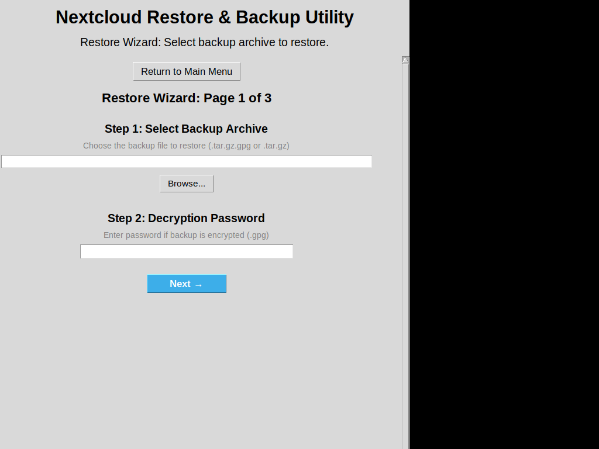
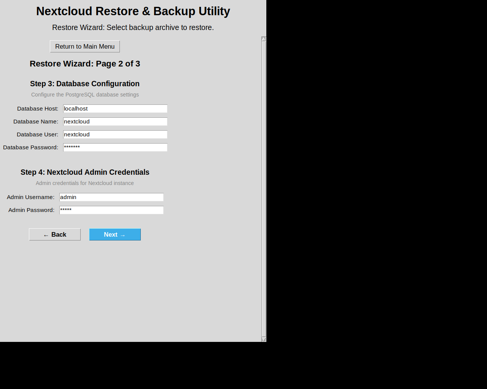
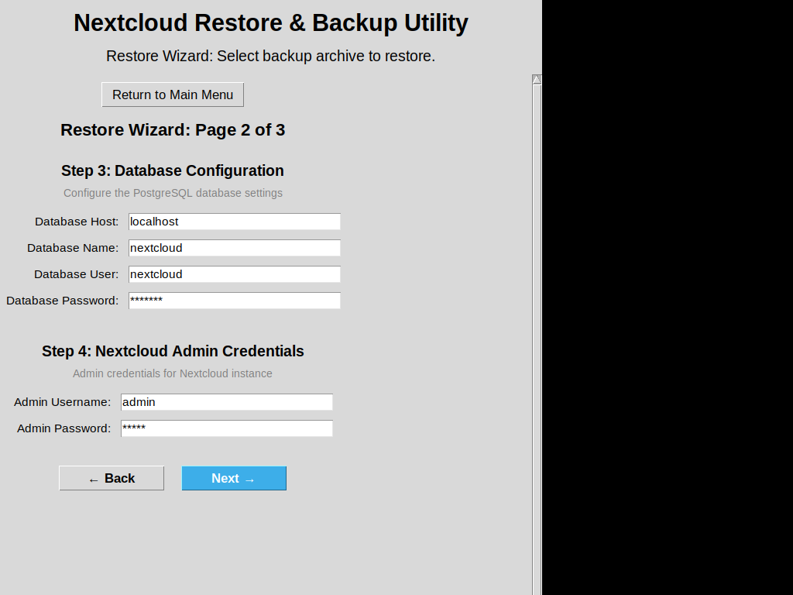
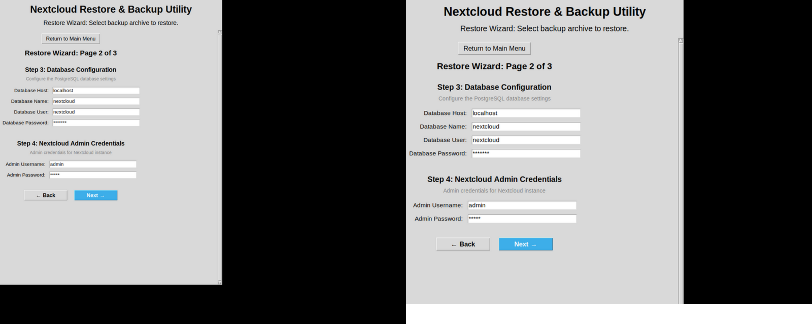
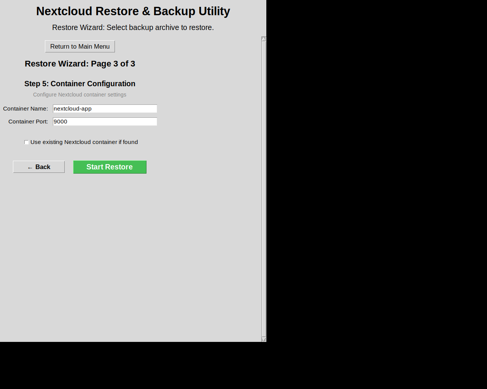
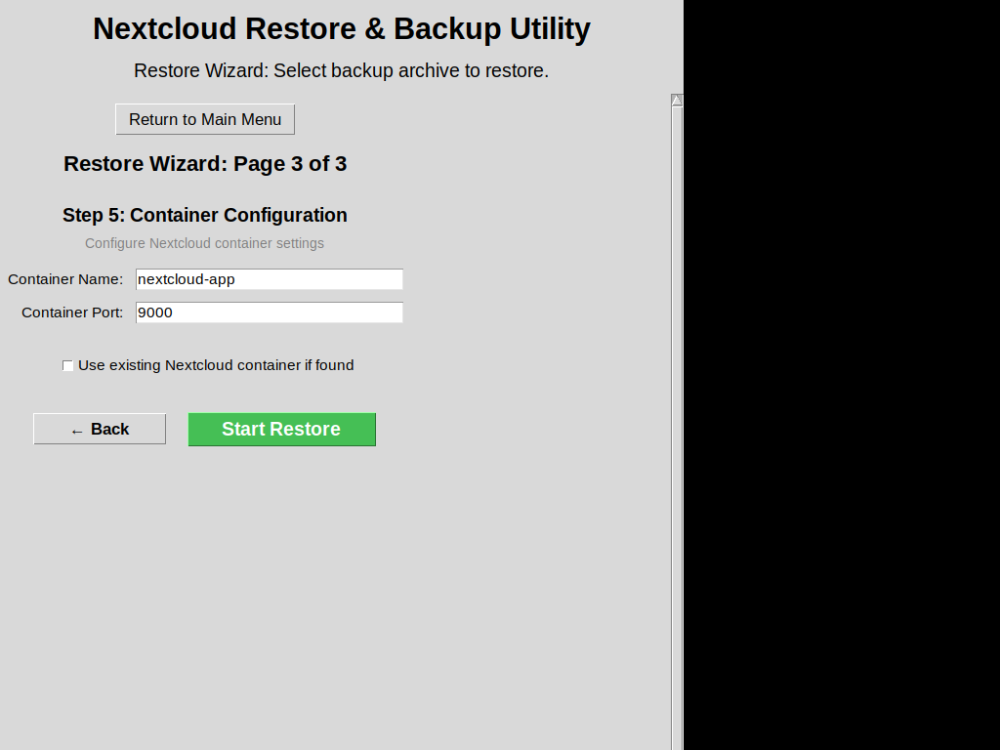
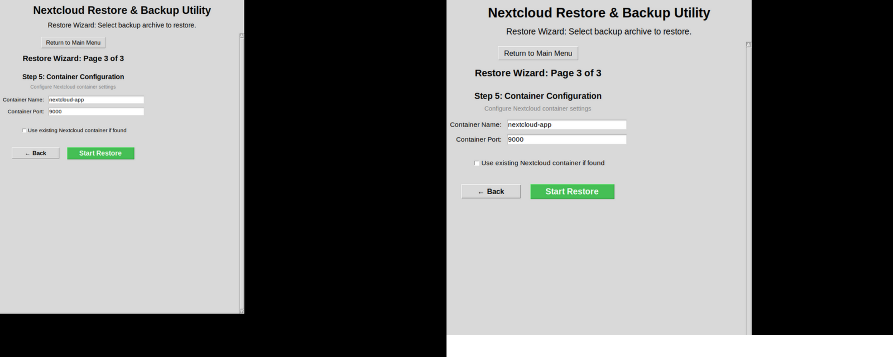

# Before & After: Centered Layout Comparison

## Overview
This document shows the visual difference between the left-aligned layout (before) and the new centered layout (after) for all three wizard pages.

## Page 1: Backup Selection and Decryption

### Before (Left-Aligned)


### After (Centered)


### Side-by-Side Comparison


**Key Differences:**
- ✅ "Return to Main Menu" button now centered
- ✅ Page title centered
- ✅ "Step 1" and "Step 2" titles centered
- ✅ All description text centered
- ✅ Input fields centered
- ✅ Browse button centered
- ✅ Next button centered

---

## Page 2: Database and Admin Configuration

### Before (Left-Aligned)


### After (Centered)


### Side-by-Side Comparison


**Key Differences:**
- ✅ All step titles centered
- ✅ Description text centered
- ✅ Database form centered as a group
- ✅ Admin credentials form centered as a group
- ✅ Navigation buttons centered

---

## Page 3: Container Configuration

### Before (Left-Aligned)


### After (Centered)


### Side-by-Side Comparison


**Key Differences:**
- ✅ "Step 5" title centered
- ✅ Description text centered
- ✅ Container form centered as a group
- ✅ Checkbox centered
- ✅ Navigation buttons centered (Back and Start Restore)

---

## Visual Improvements

### Consistency
All three pages now have a unified, centered layout that creates a more balanced and professional appearance.

### User Experience
- Better visual hierarchy with centered titles
- Clearer focus on form elements
- More intuitive navigation with centered buttons
- Professional, modern look

### Accessibility
- Easier to scan and read with centered alignment
- Better visual balance for users with different screen sizes
- More predictable layout across all pages

### Responsive Design
The centered layout works well with:
- The standard 700x900 window size
- Various screen resolutions
- Different display scaling factors

---

## Technical Changes
All changes were made using tkinter's `pack()` method with the `anchor="center"` parameter:

```python
# Example: Button centering
tk.Button(parent, text="Browse...", ...).pack(pady=5, anchor="center")

# Example: Label centering
tk.Label(parent, text="Step 1: ...", ...).pack(pady=(10, 5), anchor="center")

# Example: Frame centering (for form groups)
db_frame.pack(pady=10, anchor="center")
```

---

## Conclusion
The centered layout provides a more polished, professional appearance while maintaining all functionality and usability improvements from previous versions. The visual consistency across all three pages creates a better user experience and makes the wizard more intuitive to use.
