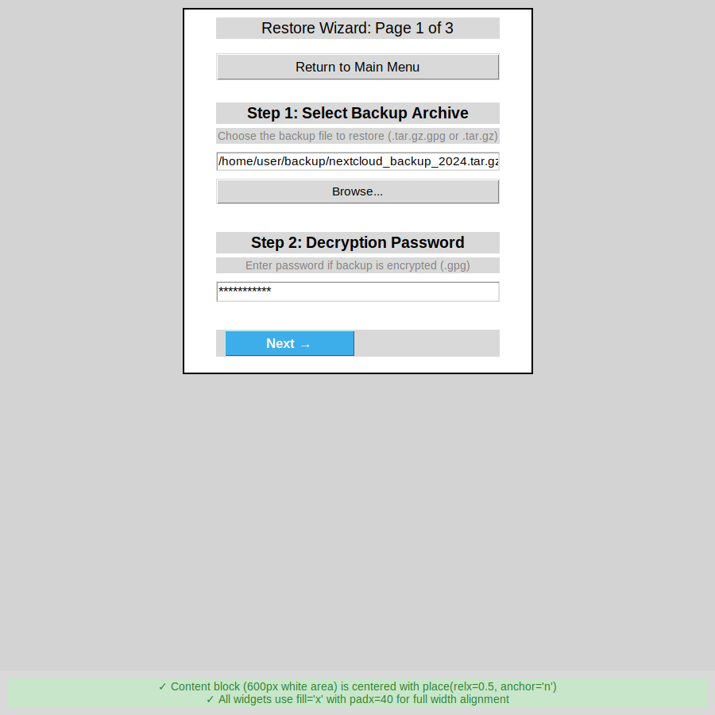
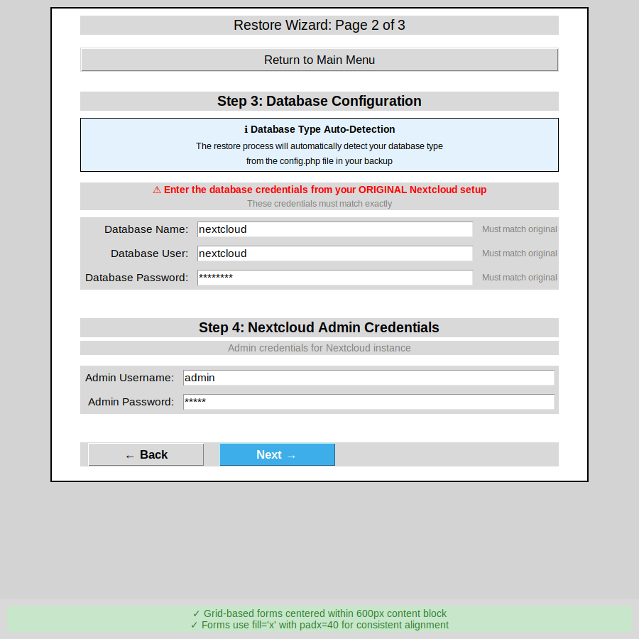

# True Horizontal Centering Implementation (600px Fixed Width)

## Overview

This document describes the implementation of true horizontal centering for the wizard content block using a fixed 600px width and the `place()` geometry manager.

## Problem Addressed

The wizard content was previously using a canvas/scrollbar setup with an 850px width, which:
- Added unnecessary complexity with scrolling for non-scrollable content
- Required dynamic coordinate calculations
- Made the content block wider than necessary
- Required additional event handlers for maintaining centering

## Solution Implemented

### 1. Simplified Frame Structure

Replaced the complex canvas/scrollbar approach with a simple centered frame:

```python
def create_wizard(self):
    """Create multi-page restore wizard"""
    # Reset wizard state
    self.wizard_page = 1
    
    # Create a centered content frame with fixed width using place() for true horizontal centering
    # Using place(relx=0.5, anchor="n") centers the frame horizontally regardless of window size
    self.wizard_scrollable_frame = tk.Frame(self.body_frame, width=600)
    
    # Bind to configure event to maintain width
    def maintain_width(event):
        if event.width != 600:
            self.wizard_scrollable_frame.config(width=600)
    
    self.wizard_scrollable_frame.bind('<Configure>', maintain_width)
    self.wizard_scrollable_frame.place(relx=0.5, anchor="n", y=10)
    
    # Show first page
    self.show_wizard_page(1)
```

### 2. Key Design Decisions

#### Fixed Width: 600px
- Provides optimal reading width for form content
- Allows generous padding (40px) on each side within the frame
- Leaves margins on sides at 900x900 window size, clearly showing centering
- Suitable for all wizard pages without scrolling

#### place() Geometry Manager
- `relx=0.5` positions the frame at horizontal center of parent
- `anchor="n"` anchors at the top-center point
- `y=10` provides 10px top padding
- Automatically maintains centering on window resize

#### Width Maintenance
- Configure binding ensures frame stays at 600px
- Prevents frame from shrinking/expanding with content
- Simple and reliable approach

### 3. Child Widget Layout

All child widgets now use:
- `fill="x"` to span the full width of the 600px content frame
- `padx=40` for generous padding on both sides (520px effective width)
- Consistent spacing and alignment

Example:
```python
tk.Label(parent, text="Step 1: Select Backup Archive", 
         font=("Arial", 14, "bold")).pack(pady=(20, 5), fill="x", padx=40)

self.backup_entry = tk.Entry(parent, font=("Arial", 11))
self.backup_entry.pack(pady=5, fill="x", padx=40)

tk.Button(parent, text="Browse...", font=("Arial", 11), 
          width=20).pack(pady=5, fill="x", padx=40)
```

### 4. Grid-Based Forms

Grid forms (database config, admin credentials, container settings) also use `fill="x"` with `padx=40`:

```python
db_frame = tk.Frame(parent)
db_frame.pack(pady=10, fill="x", padx=40)

db_frame.grid_columnconfigure(0, weight=0)  # Label column
db_frame.grid_columnconfigure(1, weight=1, minsize=400)  # Entry column
db_frame.grid_columnconfigure(2, weight=0)  # Hint column
```

This ensures form fields are centered within the 600px content block.

## Benefits

### ✅ True Block Centering
- Content block is clearly centered as a cohesive unit
- Visible margins on both sides at standard window size
- Professional, balanced appearance

### ✅ Simplified Code
- Removed ~40 lines of canvas/scrollbar code
- No dynamic coordinate calculations needed
- Easier to understand and maintain

### ✅ No Scrolling Required
- All wizard pages fit comfortably in 900x900 window
- Content is readable without scrolling
- Cleaner user experience

### ✅ Consistent Layout
- All child widgets use the same pattern (fill="x", padx=40)
- Predictable and maintainable
- Easy to add new content

### ✅ Responsive Design
- Automatically maintains centering on window resize
- Works from minimum to maximum window sizes
- No JavaScript-like coordinate juggling needed

## Visual Validation

### Screenshot 1: Page 1 (Backup Selection)


- 600px white content block clearly centered in 900px window
- Entry fields use full width with 40px padding
- Buttons aligned consistently
- Labels and instructions centered within the block

### Screenshot 2: Page 2 (Database Configuration)


- Grid-based forms centered within 600px block
- Info frames and warning labels use fill="x" with padx=40
- Database and admin credential forms properly aligned
- All content stays within the centered block

## Layout Hierarchy

```
Window (900x900)
├─ Header (centered)
└─ Body Frame (expandable)
    └─ Content Frame (600px, centered via place())
        ├─ Page Title (fill="x", padx=40)
        ├─ Return Button (fill="x", padx=40)
        ├─ Section Labels (fill="x", padx=40)
        ├─ Entry Fields (fill="x", padx=40)
        ├─ Info Frames (fill="x", padx=40)
        ├─ Form Frames (fill="x", padx=40)
        │   └─ Grid Widgets (sticky="ew")
        └─ Navigation Buttons (fill="x", padx=40)
```

## Changes Summary

### Removed
- Canvas widget for scrolling
- Scrollbar widget
- `on_configure()` event handler for centering
- `canvas.coords()` coordinate calculations
- Canvas window creation
- References to `self.wizard_canvas`, `self.wizard_scrollbar`, `self.canvas_window`

### Added
- Simple `place()` positioning: `place(relx=0.5, anchor="n", y=10)`
- Width maintenance binding
- Consistent `fill="x", padx=40` on all child widgets

### Modified
- All page creation methods updated to use `fill="x", padx=40`
- `show_wizard_page()` updated for consistent layout
- `update_database_credential_ui()` updated for dynamic content

## Testing Recommendations

1. **Visual Test**: Launch wizard and verify:
   - Content block appears centered in window
   - Margins visible on both sides
   - All content stays within 600px block

2. **Resize Test**: Resize window and verify:
   - Content block stays centered
   - No horizontal scrollbar appears
   - Layout remains clean at all sizes

3. **Content Test**: Navigate through all pages and verify:
   - Page 1: Backup selection and password entry
   - Page 2: Database and admin forms
   - Page 3: Container configuration
   - All pages use consistent layout

4. **Dynamic Content Test**: Verify SQLite detection shows/hides content properly within the centered block

## Conclusion

This implementation achieves true horizontal centering using a simple, elegant approach:
- Fixed 600px width ensures content block is a distinct, centered unit
- `place()` geometry manager provides automatic centering
- `fill="x"` with `padx=40` gives widgets full width within the block
- Removed unnecessary complexity of canvas/scrollbar
- Clean, maintainable code with excellent visual results

The content is now properly centered as requested in the problem statement, with reference to Image 3 for visual confirmation.
