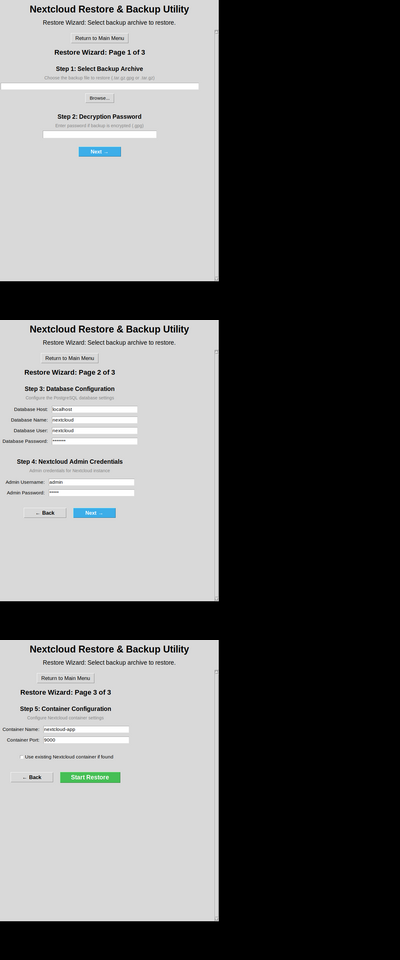

# Multi-Page Restore Wizard - Implementation Summary

## Latest Update (v11)

**Database Configuration Improvements**: Step 3 has been enhanced with clearer guidance:
- Removed Database Host field (now auto-configured)
- Added prominent warning about using ORIGINAL credentials
- Added inline help text for each database field
- See `DATABASE_CONFIG_IMPROVEMENTS.md` for details

## Overview

The Nextcloud Restore & Backup Utility has been upgraded from a single-page restore form to a **multi-page wizard** for better user experience and clearer workflow guidance.

## What Changed?

### Before (v9)
```
┌─────────────────────────────────────┐
│  Restore Wizard (Single Page)      │
├─────────────────────────────────────┤
│  Step 1: Select Backup Archive     │
│  Step 2: Decryption Password       │
│  Step 3: Database Configuration    │
│  Step 4: Admin Credentials         │
│  Step 5: Container Configuration   │
│                                     │
│  [Scroll to see all fields]        │
│  [Start Restore]                   │
└─────────────────────────────────────┘
```

### After (v10) - Multi-Page Wizard
```
┌─────────────────────────────────────┐
│  Page 1 of 3                        │
├─────────────────────────────────────┤
│  Step 1: Select Backup Archive     │
│  Step 2: Decryption Password       │
│                                     │
│  [Next →]                           │
└─────────────────────────────────────┘

┌─────────────────────────────────────┐
│  Page 2 of 3                        │
├─────────────────────────────────────┤
│  Step 3: Database Configuration    │
│  Step 4: Admin Credentials         │
│                                     │
│  [← Back]  [Next →]                 │
└─────────────────────────────────────┘

┌─────────────────────────────────────┐
│  Page 3 of 3                        │
├─────────────────────────────────────┤
│  Step 5: Container Configuration   │
│                                     │
│  [← Back]  [Start Restore]          │
└─────────────────────────────────────┘
```

## Benefits

### ✅ Improved User Experience
- **Reduced cognitive load**: Users see only 1-2 steps at a time
- **Clear progression**: Page indicators show "Page X of 3"
- **Guided workflow**: Next/Back buttons for easy navigation
- **Focused interface**: Fewer fields visible per page

### ✅ Better Organization
- **Logical grouping**: Related steps grouped together
  - Page 1: Backup selection and decryption
  - Page 2: Database and admin configuration
  - Page 3: Container settings
- **Step-by-step process**: Natural flow from backup to configuration

### ✅ Technical Improvements
- **Data persistence**: Form values saved when navigating between pages
- **State management**: `wizard_data` dictionary stores all inputs
- **Validation**: All fields validated before restore starts
- **Error handling**: Clear error messages on each page

## Implementation Details

### New Methods Added

1. **`show_wizard_page(page_num)`**
   - Displays a specific page of the wizard (1, 2, or 3)
   - Clears previous page content
   - Renders appropriate page content
   - Shows navigation buttons

2. **`create_wizard_page1(parent)`**
   - Builds UI for Page 1
   - Step 1: Backup Archive Selection
   - Step 2: Decryption Password

3. **`create_wizard_page2(parent)`**
   - Builds UI for Page 2
   - Step 3: Database Configuration
   - Step 4: Admin Credentials

4. **`create_wizard_page3(parent)`**
   - Builds UI for Page 3
   - Step 5: Container Configuration

5. **`wizard_navigate(direction)`**
   - Handles Next (+1) and Back (-1) navigation
   - Saves current page data before navigating
   - Validates page range (1-3)

6. **`save_wizard_page_data()`**
   - Saves current page inputs to `wizard_data` dictionary
   - Called automatically when navigating between pages

### State Management

```python
# Instance variables for wizard state
self.wizard_page = 1  # Current page number (1, 2, or 3)
self.wizard_data = {}  # Stores all form inputs

# Example wizard_data structure:
{
    'backup_path': '/path/to/backup.tar.gz.gpg',
    'password': 'encryption_password',
    'db_host': 'localhost',
    'db_name': 'nextcloud',
    'db_user': 'nextcloud',
    'db_password': 'example',
    'admin_user': 'admin',
    'admin_password': 'admin',
    'container_name': 'nextcloud-app',
    'container_port': '9000',
    'use_existing': False
}
```

## Testing

All functionality has been tested and verified:

- ✅ Navigation works correctly (Next/Back buttons)
- ✅ Data persists when moving between pages
- ✅ Form fields restore values from wizard_data
- ✅ All 5 steps accessible across 3 pages
- ✅ Validation works on final page before restore
- ✅ Progress bar and error handling maintained
- ✅ Screenshots captured for all pages

See `test_complete_wizard.py` for comprehensive test suite (12 tests, all passing).

## Files Modified

1. **`nextcloud_restore_and_backup-v9.py`**
   - Added wizard state variables
   - Converted `create_wizard()` to multi-page system
   - Added new methods for page management
   - Updated validation to work with wizard_data

2. **`CHANGES.md`**
   - Documented v10 changes
   - Explained new multi-page structure

3. **`UI_SCREENSHOTS.md`**
   - Updated with multi-page wizard screenshots
   - Added navigation feature descriptions

4. **`WIZARD_SCREENSHOTS.md`** (NEW)
   - Detailed walkthrough of all 3 pages
   - Screenshots and descriptions for each page

## Screenshots

### Page 1: Backup Selection and Decryption


### Page 2: Database and Admin Configuration


### Page 3: Container Configuration


### Flow Overview


## Backwards Compatibility

✅ **All previous functionality preserved:**
- Same 5 configuration steps
- Same default values
- Same validation rules
- Same restore process
- Same progress tracking
- Same error handling

**Only change:** UI organization into multiple pages instead of single scrollable page.

## Usage

The wizard now guides users through the restore process in 3 easy pages:

1. **Start restore** from the main menu
2. **Page 1:** Select your backup file and enter decryption password (if encrypted)
3. **Page 2:** Configure database settings and admin credentials
4. **Page 3:** Set container name and port, then click "Start Restore"

Navigation is intuitive with Next/Back buttons, and all data is preserved as you move between pages.

## Conclusion

The multi-page wizard provides a cleaner, more focused interface that guides users through the restore process step by step. This improvement maintains all existing functionality while significantly enhancing the user experience.

---

**Version:** v10 (Multi-Page Wizard)  
**Previous Version:** v9 (Single-Page Form)  
**Maintained by:** Nextcloud Restore & Backup Utility Project
