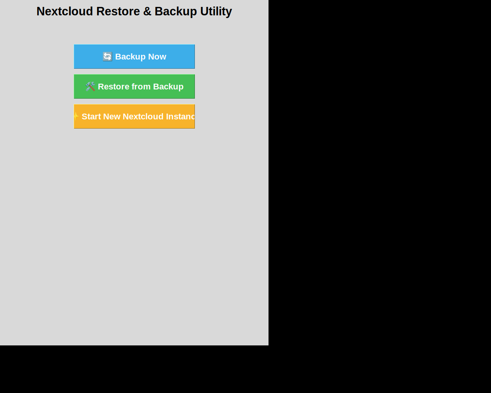

# Nextcloud Restore GUI

**The easiest way to backup and restore your Nextcloud instance - no technical knowledge required!**

This beginner-friendly application was designed to make Nextcloud backup and restore operations **simple and stress-free**. Whether you're a complete beginner or an experienced user, this tool handles all the complexity for you, including:

✅ **Automated Docker Installation** - No need to install Docker manually  
✅ **Encryption Tools Setup** - Automatically installs GPG/encryption software when needed  
✅ **Step-by-Step Wizard** - Clear, easy-to-follow interface guides you through every step  
✅ **Minimal User Input** - Just a few clicks to complete backup or restore operations  
✅ **Smart Automation** - Detects your system configuration and handles technical details automatically  

## Why This App Makes Everything Easy

Traditional Nextcloud backup and restore requires:
- 🔧 Manual Docker installation and configuration
- 🔒 Setting up encryption tools (GPG4Win on Windows, etc.)
- 📝 Complex command-line operations
- 💻 Technical knowledge of databases, containers, and file systems

**With this app, you get:**
- 🚀 **One-Click Setup** - The app installs everything you need automatically
- 🎯 **Clear Visual Interface** - No command-line knowledge required
- 🛡️ **Secure by Default** - Encryption is easy to enable with built-in setup
- 🌐 **Remote Access** - Optional Tailscale integration for accessing your backups from anywhere
- ⏰ **Scheduled Backups** - Set it and forget it with automated backup schedules

## Features

- **Complete Nextcloud Backup & Restore**: Full backup and restoration of your entire Nextcloud instance
- **Automated Setup**: Installs Docker, encryption tools, and all dependencies automatically
- **Database Backup**: Automated database backup and restoration
- **File Backup**: Comprehensive file and directory backup capabilities
- **Encrypted Backups**: Easy-to-enable encryption for secure storage
- **Cloud Storage**: Manage cloud storage backups efficiently
- **Tailscale Integration**: Secure remote access to your Nextcloud instance from anywhere
- **Scheduled Backups**: Set up automatic backups on a schedule
- **User-Friendly GUI**: Intuitive graphical interface - no command-line needed
- **Cross-Platform**: Works on Windows, Linux, and other operating systems

## Screenshots - See How Easy It Is!

### 1. Main Landing Page


**Your starting point** - The clean, intuitive interface welcomes you with two simple choices: Backup or Restore. Large, clear buttons make it easy to get started immediately. No technical jargon, no confusion - just click what you need and the app handles the rest!

### 2. Restore Wizard - Step 1: Select Your Backup


**The first step of restoration** - Browse to select your backup file, enter the encryption password if your backup is encrypted, and click Next. The wizard provides clear instructions and validates your input to prevent errors. You're guided through each field with helpful labels and tooltips.

### 3. Restore Wizard - Step 2: Configure Your Nextcloud


**Set up your Nextcloud instance** - Enter your domain name, admin username, and password. The interface provides clear labels for each field, making it obvious what information is needed. Beginners get helpful guidance, while the clean layout keeps everything organized and easy to understand.

### 4. Restore Wizard - Step 3: Advanced Options


**Fine-tune your configuration (optional)** - Advanced users can customize database settings, ports, and other technical details. However, beginners can safely use the pre-configured defaults and skip this step entirely. The app intelligently handles these settings for you, but the options are there if you need them.

## Repository Structure

The repository is organized into a clear, professional folder structure:

```
nextcloud-restore-gui/
├── src/                          # Source code
│   └── nextcloud_restore_and_backup-v9.py  # Main application
├── tests/                        # Test scripts and demos (91 files)
│   ├── test_*.py                # Test files
│   ├── demo_*.py                # Demo scripts
│   ├── validate_*.py            # Validation scripts
│   └── *.sh                     # Test shell scripts
├── docs/                         # Documentation (267 files)
│   ├── *.md                     # Markdown documentation files
│   └── *.txt                    # Text documentation files
├── config/                       # Configuration files
│   └── config.example.json      # Example configuration template
├── assets/                       # Images and static files (35 files)
│   ├── *.png                    # Screenshots and images
│   ├── *.html                   # UI mockups
│   └── *.service                # Service files
├── .gitignore                   # Git ignore rules
├── LICENSE                      # MIT License
├── README.md                    # This file
└── requirements.txt             # Python dependencies
```

## Getting Started - It's Really This Simple!

**Total Time: Less than 5 minutes from download to your first backup or restore!**

### For Complete Beginners

1. **Download** the latest release from the [Releases page](https://github.com/zubairadair-commits/nextcloud-restore-gui/releases)
2. **Double-click** the downloaded file to run it
3. **Follow the wizard** - It will:
   - ✅ Check if Docker is installed (and install it for you if not)
   - ✅ Install encryption tools if you want encrypted backups
   - ✅ Guide you through backup or restore with clear instructions
   - ✅ Show real-time progress so you know it's working

**That's it!** No technical knowledge, command-line skills, or manual configuration required.

### What Makes This So Easy?

- **Automated Installation**: The app handles installing Docker, GPG encryption tools, and any other dependencies
- **Smart Detection**: It checks what's already on your system and only installs what's missing
- **Clear Instructions**: Every step has helpful tooltips and descriptions
- **Beginner-Friendly**: Designed for people who have never used Docker or command-line tools
- **Safe Defaults**: You can accept the default options and everything will work correctly
- **Error Prevention**: The app validates your input and prevents common mistakes

## How It Handles the Technical Stuff For You

### Automated Docker Installation
- **Windows**: Downloads and installs Docker Desktop automatically
- **Linux**: Uses package managers to install Docker with one click
- **Configuration**: Sets up Docker with optimal settings for Nextcloud

### Encryption Made Easy
- **Automatic Detection**: Checks if GPG is installed on your system
- **One-Click Install**: Downloads and installs GPG4Win on Windows (or equivalent on other systems)
- **Secure Setup**: Configures encryption with strong defaults
- **Optional**: You can skip encryption if you don't need it

### Container Management
- **Automatic**: Handles all Docker container operations
- **Smart**: Detects existing Nextcloud containers
- **Safe**: Stops and starts containers safely during backup/restore
- **No Commands**: All Docker operations happen in the background

### Database Handling
- **Supported**: MySQL/MariaDB, PostgreSQL, SQLite
- **Automatic**: Detects your database type
- **Secure**: Safe backup and restore of all database data
- **No Manual Dumps**: Everything is automated

## Documentation

Comprehensive documentation is available in the `docs/` directory:
- Feature guides
- Implementation summaries
- Visual mockups and comparisons
- Developer guides
- User guides

## For Developers

If you want to contribute to the project or run from source:

1. Clone the repository:
   ```bash
   git clone https://github.com/zubairadair-commits/nextcloud-restore-gui.git
   cd nextcloud-restore-gui
   ```

2. Install dependencies (optional - only needed for testing):
   ```bash
   pip install -r requirements.txt
   ```

3. Run from source:
   ```bash
   python src/nextcloud_restore_and_backup-v9.py
   ```

4. Run tests:
   ```bash
   python -m pytest tests/
   ```

For more details, see the `docs/DEVELOPER_GUIDE.md` file.

## Contributing

Contributions are welcome! Please feel free to submit a Pull Request.

## Keywords

nextcloud, backup, restore, nextcloud-backup, nextcloud-restore, database-backup, file-backup, cloud-storage, python, gui, automation, utility, cloud-app, windows

## License

See LICENSE file for details.
