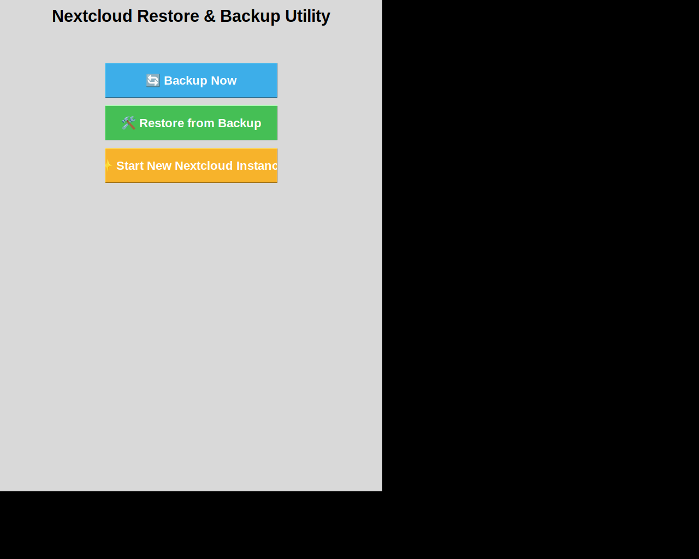
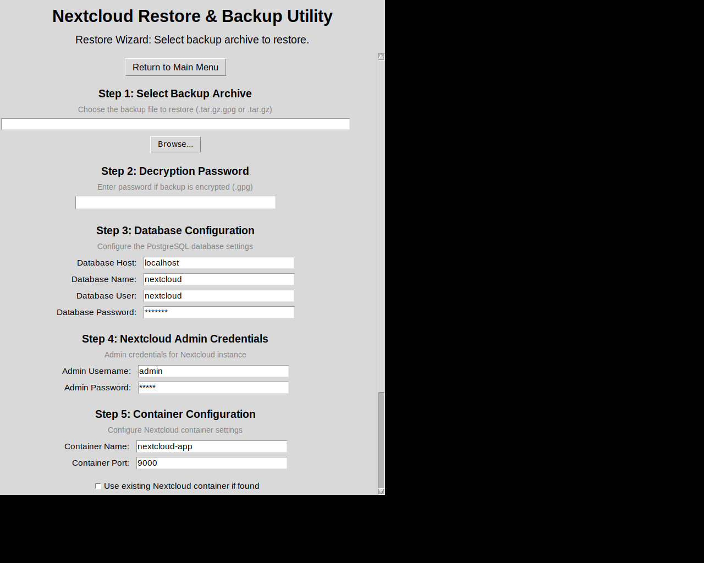

# UI Screenshots - Redesigned Restore Workflow

This document shows the new user interface for the redesigned restore workflow.

## Landing Page

The main landing page with three primary options:
- 🔄 Backup Now
- 🛠 Restore from Backup
- ✨ Start New Nextcloud Instance

## Restore Wizard - Full Form

The new restore wizard showing all input fields in the main window:

### Section 1: Backup Archive Selection
- File path input with browse button
- Supports both encrypted (.tar.gz.gpg) and unencrypted (.tar.gz) backups

### Section 2: Decryption Password
- Password field (shown only for encrypted backups)
- Masked input for security

### Section 3: Database Configuration
- Database Host (default: localhost)
- Database Name (default: nextcloud)
- Database User (default: nextcloud)
- Database Password (masked, default: example)

### Section 4: Nextcloud Admin Credentials
- Admin Username (default: admin)
- Admin Password (masked, default: admin)

### Section 5: Container Configuration
- Container Name (default: nextcloud-app)
- Container Port (default: 9000)
- Checkbox: "Use existing Nextcloud container if found"

### Additional Features
- Progress bar showing restore progress (0-100%)
- Process label showing current operation
- Error label for validation feedback and errors
- Return to Main Menu button

## Key Improvements

### Before (v8 and earlier)
- ❌ Pop-up dialogs for container name
- ❌ Pop-up dialogs for port number
- ❌ Pop-up dialog asking about existing container
- ❌ Hardcoded database credentials
- ❌ No admin credential configuration
- ❌ Context switching between main window and dialogs

### After (v9 - Current)
- ✅ All inputs in main window
- ✅ Scrollable form for easy navigation
- ✅ Clear section organization
- ✅ Configurable database credentials
- ✅ Admin credential configuration
- ✅ Pre-filled default values
- ✅ Comprehensive validation
- ✅ No pop-ups for input (only for errors/success)
- ✅ Better user experience with single-window workflow

## Validation Examples

The form validates all inputs before starting the restore:
- Backup file must exist
- Decryption password required for .gpg files
- All database fields must be filled
- Admin credentials must be provided
- Port must be a valid number (1-65535)

Error messages appear directly in the main window in red text, providing clear guidance to the user.

## Technical Details

- Window size: 700x900 (increased from 700x670)
- Scrollable canvas for better usability
- All fields use appropriate input types (text, password, checkbox)
- Default values match previous configuration
- Validation happens before restore starts
- Configuration automatically updates config.php with provided credentials
