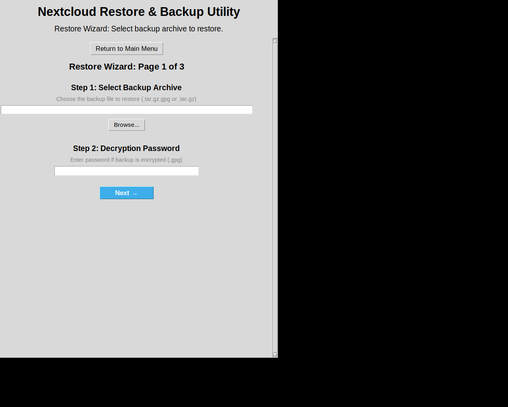
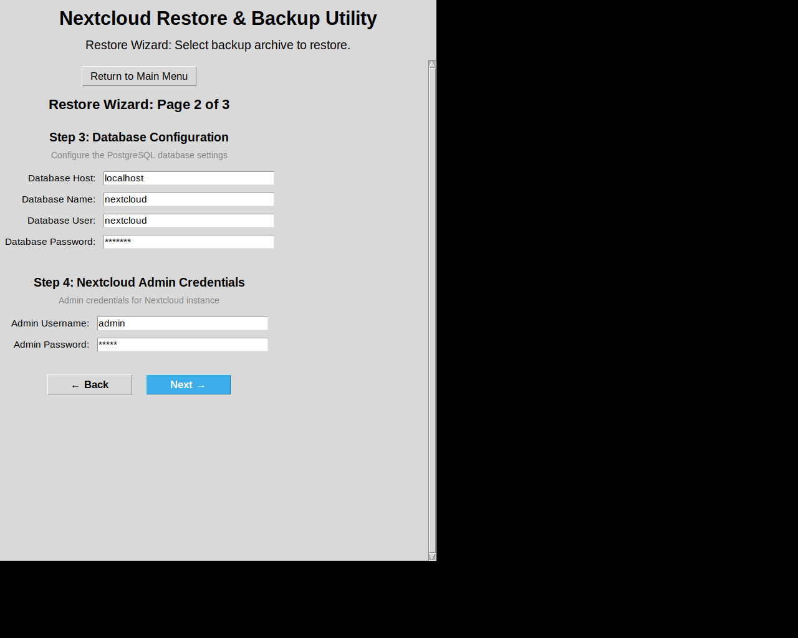

# Multi-Page Restore Wizard - Screenshots

This document shows the new multi-page restore wizard interface.

## Landing Page

The main landing page with three primary options:
- 🔄 Backup Now
- 🛠 Restore from Backup
- ✨ Start New Nextcloud Instance

Click "🛠 Restore from Backup" to enter the restore wizard.

---

## Wizard Page 1 of 3

**Page 1: Backup Selection and Decryption**

This page contains the first two steps of the restore process:

### Step 1: Select Backup Archive
- File path input field for the backup archive
- Browse button to select file using file dialog
- Supports both encrypted (.tar.gz.gpg) and unencrypted (.tar.gz) backups
- Description: "Choose the backup file to restore (.tar.gz.gpg or .tar.gz)"

### Step 2: Decryption Password
- Password input field (masked with asterisks)
- Required only for encrypted backups (.gpg files)
- Description: "Enter password if backup is encrypted (.gpg)"

**Navigation:**
- Return to Main Menu button (top)
- Next → button (bottom) to proceed to Page 2

---

## Wizard Page 2 of 3

**Page 2: Database and Admin Configuration**

This page contains steps 3 and 4 of the restore process:

### Step 3: Database Configuration
Configure the PostgreSQL database settings:
- **Database Host** (default: localhost)
- **Database Name** (default: nextcloud)
- **Database User** (default: nextcloud)
- **Database Password** (masked, default: example)
- Description: "Configure the PostgreSQL database settings"

### Step 4: Nextcloud Admin Credentials
Admin credentials for the Nextcloud instance:
- **Admin Username** (default: admin)
- **Admin Password** (masked, default: admin)
- Description: "Admin credentials for Nextcloud instance"

**Navigation:**
- Return to Main Menu button (top)
- ← Back button (bottom left) to return to Page 1
- Next → button (bottom right) to proceed to Page 3

---

## Wizard Page 3 of 3

**Page 3: Container Configuration**

This page contains the final step (Step 5) of the restore process:

### Step 5: Container Configuration
Configure Nextcloud container settings:
- **Container Name** (default: nextcloud-app)
- **Container Port** (default: 9000)
- **Checkbox:** "Use existing Nextcloud container if found"
- Description: "Configure Nextcloud container settings"

**Navigation:**
- Return to Main Menu button (top)
- ← Back button (bottom left) to return to Page 2
- **Start Restore** button (bottom right, green) to begin the restore process

After clicking "Start Restore":
- All fields are validated
- Progress bar appears showing restore progress
- Process status updates appear in real-time
- Any errors are displayed in red text

---

## Key Features

### Multi-Page Design
✅ **3 pages** organize the 5 configuration steps logically:
- Page 1: Steps 1-2 (Backup selection and decryption)
- Page 2: Steps 3-4 (Database and admin configuration)
- Page 3: Step 5 (Container configuration)

### Navigation
✅ **Next/Back buttons** for easy navigation between pages
✅ **Data persistence** - form data is saved when navigating
✅ **Page indicator** shows "Page X of 3" at the top

### User Experience
✅ **Focused interface** - users see only relevant fields per page
✅ **Reduced cognitive load** - fewer fields visible at once
✅ **Clear progression** - numbered steps guide the user
✅ **Default values** - all fields pre-filled with sensible defaults
✅ **Validation feedback** - errors displayed clearly on each page
✅ **No pop-ups** - all inputs remain in the main window

### Progress Tracking
✅ **Progress bar** appears after starting restore
✅ **Real-time status** updates during restore process
✅ **Error handling** with clear messages
✅ **Success notification** when restore completes

---

## Comparison with Previous Design

### Before (v9 - Single Page)
- All 5 steps on one long scrollable page
- Could be overwhelming for users
- All fields visible at once

### After (v10 - Multi-Page Wizard)
- 3 pages with 1-2 steps each
- Clearer step-by-step workflow
- Focused UI with fewer fields per page
- Better user guidance through the process
- Same functionality, better organization

---

## Technical Details

- **Window size:** 700x900 pixels
- **Pages:** 3 total pages
- **Navigation:** Next/Back buttons with data persistence
- **Validation:** All fields validated before restore starts
- **Progress:** Real-time progress bar and status updates
- **Error handling:** Clear error messages on each page
- **Scrollable:** Each page scrolls independently if needed

